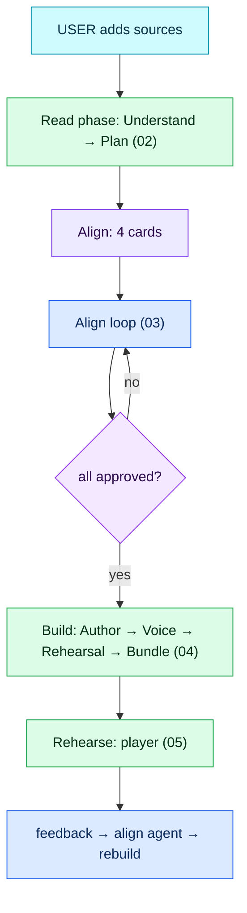

# Architecture flow — Demo Studio

Diagrams follow the Mindful Coding convention: one step per box, every box labelled
`[AGENT · model]` (an LLM decides), `[FUNCTION]` (deterministic code), `[LIBRARY · name]` or
`[DATA · store]`; decisions are diamonds with the decider on the diamond and the condition on the
edge; gates show the threshold. Source: `docs/mermaid/*.mmd` (authored by hand — update in the same
session as any structural change). Viewer: `python3 docs/build_viewer.py` → `docs/architecture-flow.html`.

Legend: 🟦 agent (LLM) · 🟩 function · 🟪 decision · ⬜ result · 🟦(cyan) question to the user · 🟪(violet) data/library.

## Gates at a glance

| Gate | Enforcer | Threshold / rule | Where |
|---|---|---|---|
| Read allowed | FUNCTION | ≥1 source; keys present or `MOCK_LLM=1` | `server/app.py` `read_sources` |
| One run per demo | FUNCTION | a second read/build/revise while a thread is alive → 409 | `orchestrator._spawn` |
| Build allowed | FUNCTION | all 4 approvals true | `orchestrator.start_build` |
| Grounding (authoring) | FUNCTION | `fact_ids ⊆ registry`; visual ref exists; text matching `NUMBERISH`/`CLAIMISH` with no fact id → `unverified` (excluded from voice + bundle) | `agents/author.validate` |
| Grounding (runtime) | FUNCTION | invalid/empty fact ids on a number/claim answer → don't-guess reply + escalate + unknown recorded | `agents/qa.answer` |
| Voice failure budget | FUNCTION | stop rendering after 4 provider errors; player falls back to browser voice | `agents/voice.render_script` |
| Rehearsal size | CONFIG | `settings.rehearsal_questions` (default 12, each a paid Claude call) | `config.REHEARSAL_QUESTIONS` |
| Player check-in | FUNCTION | 15 s countdown, 8 s auto-listen, 20 s after an answer | `web/player/player.js` `waitFor` |
| Intake listen | FUNCTION | 10 s per question; mic denied → typed fallback | `player.js` `intakeWait` |
| Approvals reset | FUNCTION | revise(understand) resets visuals + facts; edits mark author stale | `orchestrator._revise`, `apply_actions` |

## File index

| Stage | Files |
|---|---|
| Shell, routes, SSE | `server/app.py`, `server/events.py`, `web/app.js`, `web/api.js` |
| Store | `server/store.py` (`data/demos/<id>/…`) |
| Understand | `server/agents/understand.py`, `server/sources.py`, `server/llm/gemini.py`, `server/llm/claude.py`, `server/schemas.py` |
| Plan | `server/agents/plan.py` |
| Align | `server/agents/align.py`, `server/orchestrator.py` (`handle_message`, `apply_actions`, `_revise`), `web/studio/align.js` |
| Author / validator | `server/agents/author.py` |
| Voice | `server/agents/voice.py` |
| Rehearsal | `server/agents/rehearsal.py` |
| Bundle | `server/agents/bundle.py` |
| Runtime Q&A | `server/agents/qa.py` |
| Player | `web/player/player.js`, `web/studio/rehearse.js` |
| Mock mode | `server/llm/mock.py` (`MOCK_LLM=1`) |

## 01 · Master flow

Full-detail versions of 01–05 are in `docs/mermaid/` and rendered together in
`docs/architecture-flow.html`.
