# Architecture flow — Demo Studio

Diagrams follow the Mindful Coding convention: one step per box, every box labelled
`[AGENT · model]` (an LLM decides), `[FUNCTION]` (deterministic code), `[LIBRARY · name]` or
`[DATA · store]`; decisions are diamonds with the decider on the diamond and the condition on the
edge; gates show the threshold. Source: `docs/mermaid/*.mmd` (authored by hand — update in the same
session as any structural change). Viewer: `python3 docs/build_viewer.py` → `docs/architecture-flow.html`.

The Sales Trainer implementation integrated into master at the25September checkpoint includes Coach, bound word budgets, two-picture/proxy slides, customer sites, plain language, automatic answer return, Voice mode, the customer answer cache, on-demand rehearsal, bounded owner-domain web fallback, Marine/Sage/Graphite review and a measured selected1–5minute narration gate (default3). The23September WP9 paid Read was skipped; the24September runtime task separately authorized one isolated paid final journey after full mock QA, now completed with its original failures retained. These diagrams describe implemented flow, not acoustic or deployed-release acceptance. Validator-generated live-site attribution, including a normalized exact leading cited-host label, stays outside claim grounding and plain-language rewriting, then joins the spoken answer before the final word cap. An explicit leading host absent from the cited live sources is rejected.

Legend: 🟦 agent (LLM) · 🟩 function · 🟪 decision · ⬜ result · 🟦(cyan) question to the user · 🟪(violet) data/library.

Workbook feedback gate: 51/51 suites; 1,790/1,790 reported checks/groups/phases (nested coverage overlaps); deck380/380, acceptance24/24, smoke3/3. See `feedback-workbook-gates-2026-09-24.json` and the twelve-category FMEA.

Runtime recovery gate:60suites/2,335overlapping checks green, including HTML87/live40 and all changed source-domain, speech and session contracts. Exact counts, hashes, screenshots and12-category FMEA: `qa/runtime-recovery-2026-09-24/`. One completed paid final journey is recorded separately, including its semantic failure and free-tested correction. Master integration is authorized on25September; AWS remains separate.

Latest slide acceptance:15suites/2,635overlapping checks, actual published-v3 render1,505/1,505 across88states; core399/24/smoke3. The25September docs-only checkpoint rechecks the core gates and preserves application source. See `qa/slide-continuity-2026-09-24/` and `qa/master-checkpoint-2026-09-25/`.

## Gates at a glance

| Gate | Enforcer | Threshold / rule | Where |
|---|---|---|---|
| Read allowed | FUNCTION | ≥1 source and fresh observed non-mock reasoning success; explicit logged operator override; `MOCK_LLM=1` bypass | `server/app.py` `read_sources` |
| One run per demo | FUNCTION | a second read/build/revise/rehearsal while a thread is alive → 409 | `graph.py` start helpers |
| Document evidence batches | FUNCTION + AGENT | Reader inputs target20,000characters while retaining every located chunk/raw table. Pieces of the same PDF page stay together; an oversized page remains whole. Extract categorical features, pairings and fitment as well as numbers; preserve source-stated stale warnings. Partial-batch absence is not proof of a whole-upload gap. More batches mean more reader calls; schema validity does not establish semantic completeness. | `agents/understand._fact_batches`, `FACTS_SYSTEM` |
| Embedded PDF pictures | FUNCTION + AGENT | Within Understand: at most96 unique normalized pictures,48MiB combined,8MiB per image,12 million pixels,2048px edge,100 pages,256 candidates,10 PDFs and a cooperative30-second extraction budget. Existing image tagging and full pixel audit still decide visible subjects. Parent PDF remains fact authority; parent exclusion/deletion/revision governs image catalogues, line visuals, slide media and attached labels. Partial timeout extraction retries; completed manifests reuse stable pixel/revision identities. | `sources.extract_pdf_images`, `agents/understand.py`, `store.visual_allowed`, `agents/bundle.py` |
| Build allowed | FUNCTION | all 6 approvals true + observed reasoning/selected Sarvam speech readiness or explicit logged override | `orchestrator.start_build` |
| Coach playbook | AGENT + FUNCTION | Understand → Coach → Plan. Category library order, approved evidence and explicit gaps produce `playbook.json`; approved fact/allowed picture ids only, first occurrence of duplicate stop ids, first stop fundamental; USP count/name errors become visible issues, surplus USPs truncate and unsafe names strip numeric/unit/code tokens or drop. Unsupported stops become optional; every required stop needs a picture or picture gap. Reuse requires matching registry hash, library version, audience, category, formatted Coach prompt and consumed evidence/picture inputs, with no instruction; overrides are revalidated. | `agents/coach.py`, `agents/playbooks.py` |
| Planner playbook and budgets | AGENT + FUNCTION | One reviewed proof stop per supported Coach stop, preserving order and approved evidence. Prepared drafts target ceil(selected whole minutes1–5 ×60 × max(2.5, matching measured words/second) ×1.10); matching selected-language recordings can raise the target. Reserve23 overview +45 closing words; allocate feasible26–33-word batches under existing evidence and section limits. Supplemental segments share their Coach section's batch allowance. Unknown or mixed ownership cannot silently add capacity; impossible targets remain explicit. Every Author run deterministically prepares the current Plan without another planner call, persona sample or CTA change. Legacy budgets and publication limits remain unchanged. | `agents/narration.word_target`, `agents/plan.py`, `graph.plan` |
| Author word budgets | FUNCTION | Prepared stop budgets cover all of that stop’s speech; each complete line and delivery batch retains the role ceiling (46 intro/outcome/proof,48 features,44 establish; closing45). The hard global target counts all unique eligible overview/main/statement/closing speech, never deeper, film or questions, and feeds the existing repair plus at most one focused completion attempt. A structured current preparation status distinguishes ready, incomplete, no approved sources and legacy preparation; provider failures and mock placeholders remain explicit. Incomplete authoring stays pending and skips paid Deck generation and picture auditing. Direct edits preserve preparation metadata and recompute readiness; shortened text stays pending rather than becoming a legacy rewrite candidate. Split only at complete line boundaries; preserve source-stop identity and total allowance, avoid ID collisions. Legacy validation keeps its original limits. | `agents/author.py`, `agents/narration.py` |
| Planned and recorded timing | FUNCTION | Segment `planned_seconds = round(word_budget / WPS, 1)` is compared with main narration `spoken`; timeline `planned_total_seconds` is shown against full content duration and `pitch_minutes`. Full content includes check-ins and closing. Preserve historical `exact`: any measured main-line audio, not complete measurement. Per-segment `narration_measured` requires every verified main line; total measurement requires all relevant clips. Split/edit provenance preserves the original budget. Customer wait/Q&A time is outside this timeline. | `agents/author.timeline`, `agents/voice.py`, `agents/align.cards`, `web/studio/align.js` |
| Align Story order | FUNCTION + HUMAN | Existing Script card shows stops, kinds, fact/picture counts and gaps. Save persists `playbook-overrides.json`, resets Script/Visuals approvals and starts `revise plan`; Ask for this source emits existing `request_upload`. Six approvals remain. | `PATCH /align/playbook`, `agents/align.cards`, `web/studio/align.js` |
| Grounding (authoring) | FUNCTION | `fact_ids ⊆ registry`; visual ref exists; text matching `NUMBERISH`/`CLAIMISH` with no fact id → `unverified` (excluded from voice + bundle) | `agents/author.validate` |
| Script-image proof | AGENT + FUNCTION | after stable line ids: Gemini inspects every real image (batches ≤12) against every spoken line; every line and image must return; only `full` coverage binds an image to a concrete feature line; without pixel decisions, keep the existing draft refs/none and record tag proposals without applying them. Draft pictures remain unaudited; unused-image variety cannot rewrite evidence. Deck proxies do not alter this audit and never increase its coverage. | `agents/visuals.py`, `visual-audit.json` |
| Deck: media and proxy | FUNCTION | Keep the first two distinct verified image bindings in line order, with `from_line`; require full audit coverage, or accept the Author binding only when the audit is absent. If none qualify, choose a trusted matching part via `PROXY_PARTS` (confidence ≥0.6), otherwise the hero. Proxy is marked `illustration`, carries a cited tag and is never proof. Preserve first-picture `image_id`/`image_url` compatibility. | `agents/deck.choose_media` / `choose_proxy`, `schemas.SlideMedia`, `agents/bundle.py` |
| Deck: callouts | AGENT + FUNCTION | ≤3 per picture, ≤8 words each, approved fact citations and an explicit/default-first `image_id`. `author.ungrounded` drops uncited figures/claims; a proxy retains valid source-cited captions without a false anchor; fallback labels use the cited line evidence. Media edits retain label words/citations but clear obsolete geometry. Explicit Align label creation requires a unique ID, approved on-slide facts and a valid picture/line; rebuilds revalidate overrides. | `agents/deck.py`, `deck-overrides.json` |
| Deck: label position | FUNCTION | Use the owning picture's parts: confidence ≥0.6 → trusted box anchor and clear label position; else that picture's side panel. Drag coordinates are fractions of the owning picture, never the whole two-picture stage. | `agents/deck.place_callouts`, `web/slide.js` |
| Slide media review and playback | FUNCTION + HUMAN | Align provides a picker for each allowed picture; API rejects >2 entries and unknown/excluded images. Clearing media clears its picture callouts. Saved overrides are replayed safely after source exclusion; a new excluded choice is still rejected. The fitted approved player keeps two native-aspect pictures side by side even on narrow screens; unfitted legacy previews may stack. Audio-led `setRevealed(lineIdx)` emphasizes the latest eligible `from_line`; the workbook player keeps the outer picture at full opacity and dims only the inactive image to0.86 without relayout. Personalized speech remaps picture timing alongside callout reveals using the reviewed base-line positions. Proxy badges stay visible. | `PATCH /align/deck`, `web/studio/align.js`, `web/slide.js`, `web/player/player.js` |
| Grounding (runtime) | FUNCTION | Runtime-v1 graph validates approved pinned evidence IDs, quantities, explicit applicability, policy relationships, collective engine/gearbox mappings, estimates and live-web attribution; preserves supported partial sentences. Initial, repaired and cached words share this validation. Deterministic checks are not a semantic entailment proof. Legacy clients retain `qa.answer`. | `server/runtime_graph.py`, `runtime_tools.py`, `knowledge.py` |
| Runtime lookup: owner domains | FUNCTION + AGENT | Enabled top-level owner URL sources are the only permission list; re-read on each tool call. www/apex are aliases; other subdomains need explicit owner sources. Customer-selected URLs persist but must intersect that list. Relevant pages beyond the original path may be fetched inside the same domain. Upload text, history and search results cannot authorize new domains. Empty retrieval or first clean decline may try an allowed page then domain-constrained search. No owner URL means no external runtime web. Existing two-round/four-call, twelve-second, model/market, public-network and attribution guards remain. | `server/runtime_tools.py`, `runtime_graph.py`, `web/player/player.js` |
| Plain language | FUNCTION + AGENT | After row grounding and before the rendered word cap, everyday answers receive reviewed neutral whole-phrase substitutions, longest matches first. Remaining blocked terms reject the row as `technical_term`, with precise wording feedback for the existing bounded repair. Explicit technical questions and expert audiences bypass this register check, never grounding. Common terms pass; `plain_language_substitutions` follows the result into traces and sessions. Everyday FAQ answers share the map; Author treats its terms as warnings. Changed cached text invalidates its old audio. | `agents/plain_terms.py`, `runtime_graph.validate_decision` / `_repair_composition`, `agents/faq.py`, `agents/author.py`, `agents/qa.py`, `server/app.py`, `web/player/player.js` |
| Runtime providers | CONFIG + FUNCTION | Gemini → Claude → Runware; runtime-v1 graph shares a 12-second reasoning/tool budget, max2 tool rounds/4 calls. One optional composition repair uses the same approved evidence and deadline, requests no tools/CTA and passes the same validator; failed repair retains the supported original. Whole validated answer is returned before cancellable voice streaming; legacy calls retain prior request limits. | `server/llm/runtime.py`, `runtime_graph.py`, `runtime_delivery.py` |
| Build text fallback | FUNCTION | `BUILD_PROVIDERS` defaults to Gemini → Claude → Runware for text-only structured builds; Runware JSON + Pydantic, at most one repair; extracted PDFs retain source labels; media blocks never flattened; mock never calls out; vision/speech independent of text tier | `server/llm/claude.py`, `gemini.py`, `runware.py`, `agents/understand.py` |
| Publication approval boundary | FUNCTION + HUMAN | After Voice, recheck all six approvals. Hold the per-demo reentrant lock across approval check, bundle inputs, snapshot and publication writes, serialized with customer FAQ writes. A newly invalidated approval pauses in Align; the old bundle/version stays live. | `graph.after_voice`, `graph.bundle`, `agents/bundle.py`, `store._lock` |
| Publication narration minimum | FUNCTION | Before snapshot, version or bundle writes, the default guided route in every published language must contain the selected1–5minutes of readable recorded narration (three by default). Count the actual overview or fallback opening, reviewed main lines, statement check-ins and playable closing; exclude film, customer Q&A, deeper-only lines and duplicate speech. Estimates remain clearly labelled draft information; missing/corrupt clips block publication. Failure preserves the previous publication and recordings and marks Bundle pending. A measured shortfall automatically prepares a revised draft within the requested Build, then returns to Align with changed-card approvals reset and no successful Build event or second recording pass. Missing/unreadable audio returns to review without rewriting content. Normal Read/revise owns preparation; a blocked draft cannot receive Script approval through either API or chat. Compact Script timing replaces the separate manual Prepare panel; unsuccessful real drafting alone offers Retry, with reasoning readiness or its explicit override checked. | `agents/narration.py`, `agents/bundle.py`, `agents/align.cards` |
| Visual color approval | FUNCTION + HUMAN | Marine is the default; Visuals offers Marine, Sage and Graphite. A changed palette resets only Visuals approval, marks Bundle stale and returns a ready draft to Align. The published bundle carries the selected theme; no source image or evidence coordinate changes. | `PATCH /api/demos/{id}`, `agents/align.py`, `agents/bundle.py`, `web/studio/align.js`, `web/slide.js` |
| Voice completeness | FUNCTION | Locked builds retain the configured provider/speaker across narration, FAQ and fillers; matching hash caches remain usable during a circuit cooldown. Sarvam starts are paced; only 429 retries, within a bounded budget and Retry-After. Missing required audio checkpoints and fails before bundle; policy refusal is not routed around. | `agents/voice.render_script`, `llm/sarvam.py` |
| Asked and answered | FUNCTION + HUMAN | Read answers uploaded FAQ questions only; no generated question quota. Empty banks auto-approve with the specified note. Before graph reasoning, v1/live match the session snapshot/hash, then run ordinary scope/date-aware retrieval and validate the exact cached answer against that turn's eligible evidence, conditions and word cap. Any rejected citation or changed wording falls through to the graph; fresh URL verification or explicit public-web requests bypass the cache. Only a validated, unchanged hit counts an actual ask. Only clean registry answers enter the customer cache; completed streams use the exact text/voice audio cache. Failures, clarifications, calculations and live-web evidence never cache. Human edits stay exact; rejection tombstones cannot be served or regenerated. Count/audio-only updates retain approval. | `agents/faq.py`, `runtime_graph.run_turn`, `runtime_delivery.py`, `PATCH /align/faq/{id}` |
| Customer learning | FUNCTION + HUMAN | Clean declines become deduplicated counted customer unknowns, never facts. Coach reads these into evidence gaps; existing resolve-unknown and request-upload actions remain the review path. Failed repairs and provider outages do not create knowledge gaps. Old customer entries remain available only to matching pinned snapshots; new builds omit their audio and bundle entries. | `agents/faq.record_unknown`, `agents/coach.py`, `agents/align.py` |
| On-demand rehearsal | FUNCTION + USER | Build goes Voice → Bundle. Only the Rehearse button starts rehearsal, preserving publication/status/approvals. Customer entries lead, then uploaded document entries; at most five generated questions are used only if the bank is empty. Rehearsal questions do not become customer learning. | `POST /rehearsal`, `graph.start_rehearsal`, `agents/rehearsal.py`, `web/studio/rehearse.js` |
| Domain-constrained search | FUNCTION + TOOL | Explicit or evidence-fallback searches use enabled owner domains in discovery and validate every returned/fetched/redirected URL against that permission. At most one discovery and two secured page fetches within five seconds/shared turn budget; completed passages survive optional-page timeout. Whole cited passages become turn-local W evidence; snippets, model prose and search suggestions are not evidence and never enter facts/FAQ. Supplied-URL precedence and exclusions for negated/quoted search, controls, clarification, calculations and outages remain. | `runtime_tools.web_search`, `runtime_graph.reason` |
| Held citation review | FUNCTION + HUMAN | At most two retained-source reads retry the unchanged exact quote/locator rule. A PDF quote may also match one retained cell on an explicitly cited page with the same source ID and nonempty revision; no cell concatenation or fuzzy match. Bulk restore includes citation-held rows only; manual exclusions, unresolved conflicts and precedence exclusions remain. Explicit owner overrides keep the verification reason, preserve assertion IDs and old snapshots, and invalidate dependent content/approvals. No fuzzy matching or invented citations. | `knowledge.citation_verified`, `knowledge.review_held_citations`, `POST /align/facts/review-held` |
| Voice mode | FUNCTION + CUSTOMER | Welcome switch defaults on iff `bundle.runtime.continuous_voice` and no `?mute=1`. Off connects for streamed speech without requesting capture and sends `mic.set(false)`; on requests capture once. The player mic button toggles capture without reconnecting; typing stays visible. Capture ownership rejects stale ready/transcript/error events. Saved session `input_mode` complements each turn's actual source for metrics. | `web/player/player.js`, `live-voice.js`, `server/runtime_live.py`, `runtime_metrics.py` |
| Qualified microphone interruption | FUNCTION | Only a final recognition result fitting the active prompt, a question, product topic or explicit control may interrupt. Partial words, raw VAD, fragments and noise annotations never own a playback hold. Client qualifies before sending the existing interrupt command; server does not preemptively cancel on recognition. Continue/Pause/Stop/Not now dispatch locally. Generation/turn/utterance ownership rejects stale output. This text filter is not speaker identification; physical TV/cup rejection remains unmeasured. | `web/player/player.js`, `live-voice.js`, `server/runtime_live.py` |
| Player check-in and answer return | FUNCTION | After each contiguous logical section, save the next narration checkpoint, speak a question invitation, then listen for3000ms and resume automatically. Answers/declines share that owned window. Qualified final speech, typing or a chip takes the turn. Automatic return uses a cached back_to_demo clip or silence; explicit Continue uses a resume acknowledgement, never a query filler. Generic tour intake acknowledges neutrally and uses the reviewed default route. Clarifications/closing/explicit contact forms retain waits. Healthy stream deadlines refresh on progress and allow queued playback before thirty seconds of inactivity. | `web/player/player.js`, `live-voice.js` |
| Authored stop closing | AGENT + FUNCTION | `checkin` is one short closing statement, never a question. Validator flags question marks, replacing the previous opt-in-question wording warning. Question issues preserve source text/audio for repair; legacy check-ins ending in ? or ？ are skipped without speech or waiting and the run records checkin_skipped: legacy_question. | `agents/author.py`, `agents/principles.py`, `agents/plan.py` |
| Pitch time budget | FUNCTION | Explore plans unseen route and customer framing concurrently with a measured overview; graph deadline12s; failure uses reviewed route. Corrections apply at a safe boundary. | `runtime_graph.explore`, `agents/pitch.py`, `player.js` |
| Initial fundamental route | FUNCTION | Carry `fundamental` through Slide, bundle and the pitch library. For newly minimum-checked publications, the initial default guided route leads with the first fundamental, preserves buyer order, then adds whole reviewed proof stops with all their continuation batches until recorded narration reaches the published selected duration; all batches of selected features/establish stops stay together; pre-tour Q&A visits do not remove required narration. Short personalized subsets fall back to full reviewed lines, and measured closing speech remains intact. Customer-requested short tours and later refinements are exempt; legacy bundles retain their seen-stop policy. Player fallback keeps the complete reviewed route. | `agents/deck.py`, `agents/bundle.py`, `agents/pitch.py`, `player.js` |
| Bridge grounding | FUNCTION | a runtime bridge with a figure/claim and no fact id is dropped (`bridge_dropped`) | `agents/pitch.py` |
| Decline categories | AGENT rule + FUNCTION | pricing, discounts, finance, insurance, features, availability, warranty/service, comparisons → decline when not in the registry; comparisons only from approved competitor page/document facts with variant conditions and provenance when `settings.competition=on`, always with a verify caveat | `agents/qa.py` |
| Uploads | FUNCTION | 1 GB per file; AVIF/HEIC converted for the models, originals served; videos play from the original (ffmpeg optional) | `config.MAX_UPLOAD_MB`, `server/media.py` |
| Intake + opening film | FUNCTION | greet and ask exactly one needs/focus question; typing always visible; mic denied leaves the same turn open; then play the optional film in its own native-fit view with only Skip below it; slide/header/dock UI is hidden until completion, failure or Skip restores the spoken return | `player.js` `runIntake`, `playIntroFilm` |
| Slide stage | FUNCTION | The compatible `?presentation=walkthrough` URL now uses the native slide view, just like the default URL. The rejected gallery experiment no longer hides current images/tags, substitutes a closing picture or delays visuals during speech. No extra DOM, animation timers or playback owner. One to three phone labels wrap in a fixed reserved rail above the measured footer; larger groups remain scrollable. One `.slide-stack`; the24September workbook supersedes the earlier dark Marine reference: white borderless surface, smaller heading, two supported native-fit pictures, rounded edges/subtle shadow, reviewed feature cards and trusted leaders/anchors. Welcome/intake use a full-area hero with a light fade behind content; no explicit hero falls back to an existing allowed uploaded image. All reviewed labels are placed together before reveal, with a reserved on-slide caption band when needed; narration only changes their visibility. Read-only slides with intentionally absent media show exact reviewed lines in a bounded on-slide text card; no picture or feature anchor is fabricated. Speech reveal reserves text geometry, and long text scrolls within the card; Align editing retains its image controls. Align uses the same preview. The slide uses75% of the player viewport above a white conversation dock and fixed CTA footer; portrait phones receive rotation guidance; short windows reserve a minimum usable dock, and transient controls scroll without moving the slide. Reviewed words and Align coordinates remain unchanged. Customer questions route stay / jump / none on fact ids/topics; answers return to the interrupted line after the reply window, while guide clarifications keep an explicit reply wait. | `web/player/player.js` showSlideView / playLines / handleQuestion · `server/agents/deck.py` route_for |
| Storage | FUNCTION | Existing local/AWS storage abstraction is unchanged. Sessions save one second after changes, on a fifteen-second heartbeat and visibility/exit, including an immutable estimate of currently heard speech. One current request/one latest queued snapshot, ten-second queue recovery and immutable retry sequence keep saves bounded. Server ignores stale/equal/unsequenced writes after a sequenced record; legacy visits remain compatible. Ended summaries retain revision fences; public sharing recursively masks contact details while consented private records remain intact. Current locking assumes one application worker. | `web/player/player.js`, `server/app.py`, `storage.py`, `agents/summary.py` |
| Answer latency | FUNCTION | four stamps per customer turn (voice ended → STT done → QA done → first answer audio) on the session record; `/trace` rolls them up to p50 / p95 per stage; Observability › Answer latency | `web/player/player.js` handleQuestion · `server/app.py` _latency · `web/observability.js` |
| Lead capture | FUNCTION + CUSTOMER | Declines and existing qualification thresholds offer a button, never auto-open the contact form. Explicit customer choice opens it; Not now closes it, hides the offer and resumes the three-second return. New declines do not reopen dismissed forms; explicit later recap requests may. Consent/phone validation remains. A zero-minimum grid track keeps header, slide and form inside narrow viewports. | `web/player/player.js`, `web/player-ui.css`, `POST /run/lead` |
| MP4 export | FUNCTION | parked: `GET /export.mp4` → 409 until the exporter is rebuilt for slides with HTML callouts | `server/exporter.py` |
| Approvals reset | FUNCTION | new uploads and source/fact/script edits reset affected approvals and re-run the relevant alignment path | `server/app.py`, `orchestrator.py` |
| Align review completeness | FUNCTION | F and C facts are shown together for review but stored separately; API/chat edit/reject share schema and source-ownership validation. Optional truth/source corrections require existing sources; changing a product source requires fresh locator/quote/conditions, while C facts stay with their source group. Script review supports lines, one intake, check-ins and title/outcome metadata; question claims reject, changed question audio clears and downstream work becomes stale | `store.edit_fact`, `store.set_fact_approval`, `agents/align.py`, `PATCH /align/script` |
| Direct FAQ review | FUNCTION + HUMAN | A finished, current bank accepts an answer with at least one approved F/C citation; every id must be allowed, with competitors gated by the comparison setting. Partial/stale banks and active graph/stage work reject edits. Exact wording, question identity and registry hash survive; old audio/error/clarification/callback clear, excluded visuals stay excluded, and the slide is derived from the current script joined to deck design. FAQ approval resets and voice/rehearsal/bundle become stale while FAQ stays done, so ordinary Build retains the reviewed answer. Meaning and source scope remain a human check, not proven entailment | `PATCH /align/faq/{question_id}`, `agents/faq.py`, `agents/voice.py`, `web/studio/align.js` |

## File index

The professional UI adds `#/home` as the default entry, with real workspace counts and links to existing demo actions. `web/home.js`, `web/demos.js`, `web/icons.js` and `web/{design-system,studio-ui,insights-ui,player-ui}.css` own the presentation system. Sources → Align → Rehearse remains the builder workflow. Top-nav Studio starts an unsaved blank draft; the first mutation creates one demo, while explicit saved-demo URLs retain context. The compact full-width top nav uses40% less height. Rehearse removes the large heading and panel stack in favor of one feedback conversation with attachments and an explicit Run rehearsal action; the left steps are unchanged. The separately approved runtime upgrade adds the conversation graph, continuous voice and bounded tools described below. See [the UI design and file guide](design/professional-ui.md).

| Stage | Files |
|---|---|
| Shell, routes, SSE | `server/app.py`, `server/events.py`, `web/app.js`, `web/api.js` |
| Store | `server/store.py` (`data/demos/<id>/…`) |
| Understand | `server/agents/understand.py`, `server/crawl.py`, `server/knowledge.py`, `server/sources.py`, `server/llm/gemini.py`, `server/llm/claude.py`, `server/schemas.py` |
| Coach / category library | `server/agents/coach.py`, `server/agents/playbooks.py`, `playbook.json`, `playbook-overrides.json` |
| Plan / playbook binding / budgets | `server/agents/plan.py`, `server/schemas.py`, `playbook.json`, `playbook-overrides.json` |
| Align | `server/agents/align.py`, `server/orchestrator.py` (`handle_message`, `apply_actions`, `_revise`), direct review routes in `server/app.py`, `web/studio/align.js` |
| Author / validator / pixel audit | `server/agents/author.py`, `server/agents/visuals.py`, `visual-audit.json` |
| Deck (one slide, up to two pictures per segment) | `server/agents/deck.py`, `server/schemas.py` (`SlideMedia`, `Callout.image_id`), `deck.json`, `deck-overrides.json`, `deck.<lang>.json`, `web/slide.js` |
| Voice | `server/agents/voice.py` |
| Rehearsal | `server/agents/rehearsal.py` |
| Bundle | `server/agents/bundle.py` |
| Runtime Q&A | `server/runtime_graph.py`, `runtime_state.py`, `runtime_tools.py`, `knowledge.py`, `llm/runtime.py`; legacy `agents/qa.py` |
| Plain terminology | `server/agents/plain_terms.py`; shared by runtime validation, FAQ answers, cached/legacy answers and Author warnings |
| Voice mode, continuous capture and delivery | `web/player/player.js`, `live-voice.js`, `voice-worklet.js`, `server/runtime_live.py`, `runtime_delivery.py`, `runtime_metrics.py`, `llm/sarvam_stream.py` |
| Readiness and cohorts | `server/readiness.py`, `runtime_metrics.py`, `web/provider-readiness.js`, `web/observability.js` |
| Player | `web/player/player.js`, `web/studio/rehearse.js` (`server/exporter.py` parked) |
| Mock mode | `server/llm/mock.py` (`MOCK_LLM=1`) |
| Playground | `web/playground.js`, `POST /evals`, `GET /usage`, `GET /faq-template` in `server/app.py` |
| Usage / cost | `server/usage.py` (contextvars; `usage.jsonl` per demo; price table overridable in `.env`; Runware returned USD wins, Gemini text includes thinking tokens and uses the call-date promotional rate) |
| Media | `server/media.py` (AVIF/HEIC → JPEG for the models; optional ffmpeg 720p proxy + fast-start) |
| Sales layer | `server/agents/principles.py`, `pitch.py`, scorecard in `rehearsal.py`, `llm/sarvam.py` |

## 01 · Master flow

```mermaid
%% 01 · Master flow — Demo Studio (Sources → Align → Rehearse)
flowchart TD
  LG["Since 2026-09-04 this flow runs as ONE LangGraph graph — server/graph.py<br/>see diagram 00 (auto-exported) · Align = interrupt · sqlite checkpoints"]:::data
  PROV["TEXT providers · MODEL_TIER=eval default, customer opt-in<br/>[FUNCTION · server/config.py: health + llm/*]<br/>build: Gemini → Claude → Runware (configurable) · runtime: Gemini → Claude → Runware<br/>Runware: native JSON + Pydantic + one repair · usage + failure traces<br/>vision/speech keep their own models"]:::data
  PROV -.-> READ
  PROV -.-> ALIGN
  U["USER adds sources<br/>[ask · Studio › Sources]<br/>in: video, images, PDF/DOCX/TXT, product URL, pasted brand text"]:::ask
  ING["store.add_*_source<br/>[FUNCTION · server/store.py]<br/>in: uploads / URL<br/>out: sources[] in data/demos/id/demo.json"]:::fn
  READBTN["POST /api/demos/id/read<br/>[FUNCTION · server/app.py]<br/>gate: ≥1 source · keys present or MOCK_LLM=1"]:::fn
  READ["READ phase (thread)<br/>[FUNCTION · graph.py]<br/>Understand → Coach → Plan → Author → Deck → FAQ → opening message<br/>Coach progress label: Sales playbook · see diagrams 02 / 04"]:::fn
  SSE["GET /api/demos/id/events<br/>[FUNCTION · SSE, polls events.py every 0.35 s]<br/>out: progress / stage / status / message / phase_done"]:::fn
  OVER1["UI overlay<br/>'Reading your sources…'<br/>[FUNCTION · web/studio/align.js]"]:::term
  CARDS["Align: 6 cards<br/>Visuals · Facts · Script (Story order + slides) · Asked and answered · Persona & voice · CTAs<br/>[DATA · understanding.json + playbook.json + plan.json + script.json + deck.json + faq.json]"]:::data
  DOCK["USER speaks to the prompt dock<br/>[ask · text + optional files]"]:::ask
  ALIGN["Align loop<br/>[AGENT · Claude text tier → actions]<br/>see diagram 03"]:::agent
  APPR{"all 6 cards approved?<br/>[FUNCTION · demo.approvals]"}:::dec
  BUILD["BUILD phase (thread)<br/>[FUNCTION · graph.py]<br/>Voice → Bundle<br/>see diagram 04"]:::fn
  OVER2["UI overlay<br/>'Building your demo…'"]:::term
  BUNDLE["bundle.json<br/>[DATA · data/demos/id/bundle.json]"]:::data
  PLAY["Rehearse: player<br/>[FUNCTION · web/player/player.js]<br/>continuous stop narration · answers resume after 3 s · clarifications wait<br/>owned voice/typed turns; see diagram 05"]:::fn
  FB["USER gives feedback<br/>[ask · Rehearse feedback chat]"]:::ask
  FBA["POST /align + attachments → align agent (context=rehearse)<br/>[AGENT · Claude text tier]<br/>revise('author'|'plan'|'coach'|'understand') → human Align"]:::agent
  REHEARSE["USER selects Run rehearsal<br/>[ASK · Rehearse feedback chat]<br/>POST /api/demos/id/rehearsal · customer questions first, then uploaded questions<br/>empty bank only: at most five sample questions; diagnostics preserve publication"]:::ask
  HOME["Home workspace<br/>[FUNCTION · web/home.js · #/home default]<br/>real demo/session counts · recent demos · existing create/open actions"]:::fn
  LIB["My demos tab<br/>[DATA · list of data/demos/*/demo.json]<br/>search/filter · approved bundle thumbnails"]:::data

  HOME --> LIB
  HOME -.->|"create → Sources"| U
  U --> ING --> READBTN --> READ --> SSE --> OVER1 --> CARDS
  CARDS --> DOCK --> ALIGN --> CARDS
  CARDS --> APPR
  APPR -- "no" --> DOCK
  APPR -- "yes · POST /build" --> BUILD --> OVER2 --> BUNDLE --> PLAY
  PLAY --> FB --> FBA -.->|"review changed cards before Build"| CARDS
  PLAY -.-> REHEARSE
  LIB -.-> U

  classDef agent fill:#dbeafe,stroke:#2563eb,color:#0b2a5b;
  classDef fn fill:#dcfce7,stroke:#16a34a,color:#052e16;
  classDef dec fill:#f3e8ff,stroke:#9333ea,color:#2a0a4a;
  classDef term fill:#e5e7eb,stroke:#6b7280,color:#111827;
  classDef ask fill:#cffafe,stroke:#0891b2,color:#083344;
  classDef data fill:#ede9fe,stroke:#7c3aed,color:#2a0a4a;
```

Full-detail versions of 01–05 are in `docs/mermaid/` and rendered together in
`docs/architecture-flow.html`.
