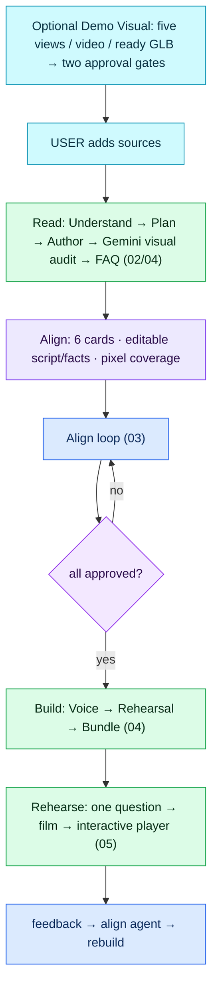

# Architecture flow — Demo Studio

Diagrams follow the Mindful Coding convention: one step per box, every box labelled
`[AGENT · model]` (an LLM decides), `[FUNCTION]` (deterministic code), `[LIBRARY · name]` or
`[DATA · store]`; decisions are diamonds with the decider on the diamond and the condition on the
edge; gates show the threshold. Source: `docs/mermaid/*.mmd` (authored by hand — update in the same
session as any structural change). Viewer: `python3 docs/build_viewer.py` → `docs/architecture-flow.html`.

Legend: 🟦 agent (LLM) · 🟩 function · 🟪 decision · ⬜ result · 🟦(cyan) question to the user · 🟪(violet) data/library.

## Gates at a glance

| Gate | Enforcer | Threshold / rule | Where |
|---|---|---|---|
| 3D image input | FUNCTION | exactly five required product views; front ¾ is the real identity view when clear | `server/visual.py` |
| 3D video input | FUNCTION + AGENT | ≥1 readable frame; Gemini selects real angles; Nano Banana 2 Lite creates only missing views | `server/visual.py`, `server/media.py` |
| Generated-view approval | USER | every real/AI source view is reviewed before any paid Runware call; a real identity view is always submitted first | `server/visual.py` |
| Direct 3D upload | FUNCTION | self-contained `.glb`, ≤150 MB, GLB v2 magic/length/alignment plus JSON-scene chunk; enters review at $0 | `server/visual.py` `add_glb` |
| 3D provider | LIBRARY | Rodin Gen-2: up to 5 approved views (default); Tripo v3.1: up to 4; TRELLIS.2: 1; real views precede approved AI gap-fill; exact returned cost traced | `server/llm/runware.py` |
| 3D asset approval | USER | generated or uploaded review attempt must be explicitly approved before it enters the bundle / My Assets | `server/visual.py` |
| Read allowed | FUNCTION | ≥1 source; keys present or `MOCK_LLM=1` | `server/app.py` `read_sources` |
| One run per demo | FUNCTION | a second read/build/revise while a thread is alive → 409 | `orchestrator._spawn` |
| Build allowed | FUNCTION | all 6 approvals true | `orchestrator.start_build` |
| Grounding (authoring) | FUNCTION | `fact_ids ⊆ registry`; visual ref exists; text matching `NUMBERISH`/`CLAIMISH` with no fact id → `unverified` (excluded from voice + bundle) | `agents/author.validate` |
| Script-image proof | AGENT + FUNCTION | after stable line ids: Gemini inspects every real image (batches ≤12) against every spoken line; every line and image must return; only `full` coverage binds an image to a concrete feature line; otherwise 3D/card; model failure uses conservative rules | `agents/visuals.py`, `visual-audit.json` |
| Grounding (runtime) | FUNCTION | invalid/empty fact ids on a number/claim answer → don't-guess reply + escalate + unknown recorded | `agents/qa.answer` |
| Voice failure budget | FUNCTION | stop rendering after 4 provider errors; player falls back to browser voice | `agents/voice.render_script` |
| Rehearsal size | CONFIG | `settings.rehearsal_questions` (default 12, each a paid Claude call) | `config.REHEARSAL_QUESTIONS` |
| Player check-in | FUNCTION | 15 s countdown, 8 s auto-listen, 20 s after an answer | `web/player/player.js` `waitFor` |
| Pitch time budget | FUNCTION | soft JSON + `effort: low` + 50 s API timeout; player waits ≤45 s then falls back to the standard route (`personalized:false` in the session) | `agents/pitch.py`, `player.js` `startAfterIntake` |
| Bridge grounding | FUNCTION | a runtime bridge with a figure/claim and no fact id is dropped (`bridge_dropped`) | `agents/pitch.py` |
| Decline categories | AGENT rule + FUNCTION | pricing, discounts, finance, insurance, features, availability, warranty/service, comparisons → decline when not in the registry; comparisons only from competitor URLs when `settings.competition=on`, always with a verify caveat | `agents/qa.py` |
| Uploads | FUNCTION | 1 GB per file; AVIF/HEIC converted for the models, originals served; videos play from the original (ffmpeg optional) | `config.MAX_UPLOAD_MB`, `server/media.py` |
| Intake + opening film | FUNCTION | greet and ask exactly one needs/focus question; mic denied → typed fallback; then play the optional film with audio and an explicit spoken return | `player.js` `runIntake`, `playIntroFilm` |
| Spoken visual stage | FUNCTION | 3D for broad exterior; literal evidence only on full coverage; otherwise a ≤3-row keyword card over the 3D placeholder; cards omit source-locator prose | `agents/visuals.display_mode`, `player.js` `present`, `showCard` |
| Lead capture | FUNCTION | open dismissible form after ≥60% of route, ≥2 questions, or any unknown answer; valid phone is ten digits starting 6–9 | `player.js`, `POST /run/lead` |
| MP4 export | FUNCTION + LIBRARY | linear video export is rendered on demand; cached MP4 is downloaded from the player header | `server/exporter.py`, `GET /export.mp4` |
| Approvals reset | FUNCTION | new uploads and source/fact/script edits reset affected approvals and re-run the relevant alignment path | `server/app.py`, `orchestrator.py` |

## File index

| Stage | Files |
|---|---|
| Shell, routes, SSE | `server/app.py`, `server/events.py`, `web/app.js`, `web/api.js` |
| Demo Visual / assets | `server/visual.py`, `server/llm/runware.py`, `web/studio/visual.js`, `web/assets.js` |
| Store | `server/store.py` (`data/demos/<id>/…`) |
| Understand | `server/agents/understand.py`, `server/sources.py`, `server/llm/gemini.py`, `server/llm/claude.py`, `server/schemas.py` |
| Plan | `server/agents/plan.py` |
| Align | `server/agents/align.py`, `server/orchestrator.py` (`handle_message`, `apply_actions`, `_revise`), `web/studio/align.js` |
| Author / validator / pixel audit | `server/agents/author.py`, `server/agents/visuals.py`, `visual-audit.json` |
| Voice | `server/agents/voice.py` |
| Rehearsal | `server/agents/rehearsal.py` |
| Bundle | `server/agents/bundle.py` |
| Runtime Q&A | `server/agents/qa.py` |
| Player / MP4 export | `web/player/player.js`, `web/studio/rehearse.js`, `server/exporter.py` |
| Mock mode | `server/llm/mock.py` (`MOCK_LLM=1`) |
| Playground | `web/playground.js`, `POST /evals`, `GET /usage`, `GET /faq-template` in `server/app.py` |
| Usage / cost | `server/usage.py` (contextvars; `usage.jsonl` per demo; price table overridable in `.env`) |
| Media | `server/media.py` (AVIF/HEIC → JPEG for the models; optional ffmpeg 720p proxy + fast-start) |
| Sales layer | `server/agents/principles.py`, `pitch.py`, scorecard in `rehearsal.py`, `llm/sarvam.py` |

## 01 · Master flow

Full-detail versions of 01–05 are in `docs/mermaid/` and rendered together in
`docs/architecture-flow.html`.
