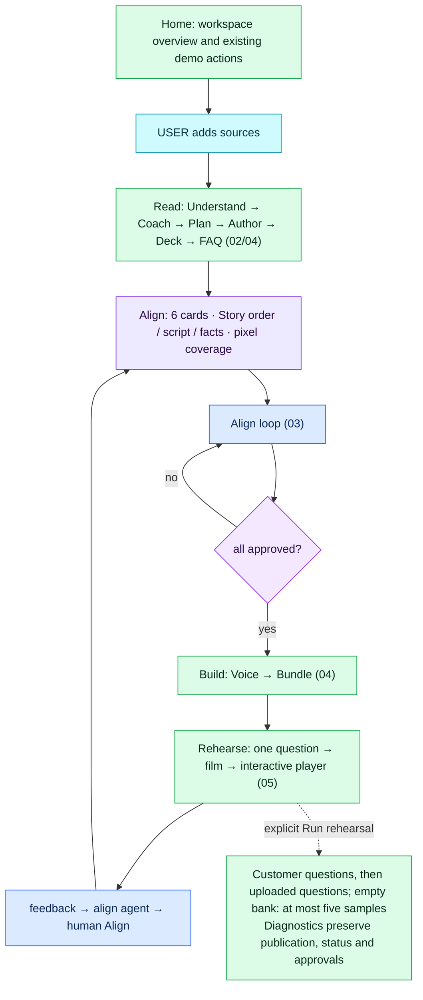

# Architecture flow — Demo Studio

Diagrams follow the Mindful Coding convention: one step per box, every box labelled
`[AGENT · model]` (an LLM decides), `[FUNCTION]` (deterministic code), `[LIBRARY · name]` or
`[DATA · store]`; decisions are diamonds with the decider on the diamond and the condition on the
edge; gates show the threshold. Source: `docs/mermaid/*.mmd` (authored by hand — update in the same
session as any structural change). Viewer: `python3 docs/build_viewer.py` → `docs/architecture-flow.html`.

The Sales Trainer implementation on `codex/sales-trainer-flow` includes Coach, bound word budgets, two-picture/proxy slides, customer sites, plain language, automatic answer return, Voice mode, the customer answer cache, on-demand rehearsal, bounded public-web fallback, Marine/Sage/Graphite review and a measured three-minute default narration gate. The 23 September brief's paid Read remains skipped because authorization and cap are blank; these diagrams describe implemented control flow, not new live-provider or acoustic acceptance. Validator-generated live-site attribution, including a normalized exact leading cited-host label, stays outside claim grounding and plain-language rewriting, then joins the spoken answer before the final word cap. An explicit leading host absent from the cited live sources is rejected.

Legend: 🟦 agent (LLM) · 🟩 function · 🟪 decision · ⬜ result · 🟦(cyan) question to the user · 🟪(violet) data/library.

## Gates at a glance

| Gate | Enforcer | Threshold / rule | Where |
|---|---|---|---|
| Read allowed | FUNCTION | ≥1 source and fresh observed non-mock reasoning success; explicit logged operator override; `MOCK_LLM=1` bypass | `server/app.py` `read_sources` |
| One run per demo | FUNCTION | a second read/build/revise/rehearsal while a thread is alive → 409 | `graph.py` start helpers |
| Build allowed | FUNCTION | all 6 approvals true + observed reasoning/selected Sarvam speech readiness or explicit logged override | `orchestrator.start_build` |
| Coach playbook | AGENT + FUNCTION | Understand → Coach → Plan. Category library order, approved evidence and explicit gaps produce `playbook.json`; approved fact/allowed picture ids only, first occurrence of duplicate stop ids, first stop fundamental; USP count/name errors become visible issues, surplus USPs truncate and unsafe names strip numeric/unit/code tokens or drop. Unsupported stops become optional; every required stop needs a picture or picture gap. Reuse requires matching registry hash, library version, audience, category and consumed evidence/picture inputs, with no instruction; overrides are revalidated. | `agents/coach.py`, `agents/playbooks.py` |
| Planner playbook and budgets | AGENT + FUNCTION | Load the effective reviewed playbook before the registry. One proof segment per required stop in its order; missing coverage is inserted with an issue, optional/unmapped proof stops are excluded, stop evidence comes first without dropping approved Planner additions; inherit exactly three valid Coach USPs, otherwise retain Planner USPs with an issue. `SegmentPlan` carries `stop_id`, `fundamental`, `word_budget`; `Plan` carries `playbook_version` and `total_words = round(max(3, pitch_minutes) × 60 × WPS)`. Reserve 23 overview and 45 closing words; allocate the remainder to guided proof/features/establish stops, with separate Browse intro/outcome budgets. Clamp to 22–the current Author role ceiling and proportionally rescale beyond 10% target drift; an infeasible total remains a visible issue. | `agents/plan.py` `_enforce_playbook` / `_enforce_budget`, `schemas.py` |
| Author word budgets | FUNCTION | Segment budget comes from Plan, or the role ceiling for legacy upper checks. Above budget +4 → issue; below an explicit budget −10 → advisory warning. Legacy drafts with no allocation receive no new under-budget warning. Hard ceilings: intro/outcome/proof 46, features 48, establish 44; closing 45. Guided route cap = `round(max(3, pitch_minutes) × 60 × WPS) + 40`. New authored drafts surface a distinct-supported-narration deficit to the existing single repair; legacy validation remains unchanged. Splitting starts above role ceiling +4 at existing line boundaries. Grounding checks remain unchanged. | `agents/author.py` `validate`, `route_limit`, `split_long_batches` |
| Planned and recorded timing | FUNCTION | Segment `planned_seconds = round(word_budget / WPS, 1)` is compared with main narration `spoken`; timeline `planned_total_seconds` is shown against full content duration and `pitch_minutes`. Full content includes check-ins and closing. Preserve historical `exact`: any measured main-line audio, not complete measurement. Per-segment `narration_measured` requires every verified main line; total measurement requires all relevant clips. Split/edit provenance preserves the original budget. Customer wait/Q&A time is outside this timeline. | `agents/author.timeline`, `agents/voice.py`, `agents/align.cards`, `web/studio/align.js` |
| Align Story order | FUNCTION + HUMAN | Existing Script card shows stops, kinds, fact/picture counts and gaps. Save persists `playbook-overrides.json`, resets Script/Visuals approvals and starts `revise plan`; Ask for this source emits existing `request_upload`. Six approvals remain. | `PATCH /align/playbook`, `agents/align.cards`, `web/studio/align.js` |
| Grounding (authoring) | FUNCTION | `fact_ids ⊆ registry`; visual ref exists; text matching `NUMBERISH`/`CLAIMISH` with no fact id → `unverified` (excluded from voice + bundle) | `agents/author.validate` |
| Script-image proof | AGENT + FUNCTION | after stable line ids: Gemini inspects every real image (batches ≤12) against every spoken line; every line and image must return; only `full` coverage binds an image to a concrete feature line; model failure uses conservative rules. Deck proxies do not alter this audit and never increase its coverage. | `agents/visuals.py`, `visual-audit.json` |
| Deck: media and proxy | FUNCTION | Keep the first two distinct verified image bindings in line order, with `from_line`; require full audit coverage, or accept the Author binding only when the audit is absent. If none qualify, choose a trusted matching part via `PROXY_PARTS` (confidence ≥0.6), otherwise the hero. Proxy is marked `illustration`, carries a cited tag and is never proof. Preserve first-picture `image_id`/`image_url` compatibility. | `agents/deck.choose_media` / `choose_proxy`, `schemas.SlideMedia`, `agents/bundle.py` |
| Deck: callouts | AGENT + FUNCTION | ≤3 per picture, ≤8 words each, approved fact citations and an explicit/default-first `image_id`. `author.ungrounded` drops uncited figures/claims; a proxy gets a derived label from its first cited fact. Align overrides retain picture ownership. | `agents/deck.py`, `deck-overrides.json` |
| Deck: label position | FUNCTION | Use the owning picture's parts: confidence ≥0.6 → trusted box anchor and clear label position; else that picture's side panel. Drag coordinates are fractions of the owning picture, never the whole two-picture stage. | `agents/deck.place_callouts`, `web/slide.js` |
| Slide media review and playback | FUNCTION + HUMAN | Align provides a picker for each allowed picture; API rejects >2 entries and unknown/excluded images. Clearing media clears its picture callouts. Saved overrides are replayed safely after source exclusion; a new excluded choice is still rejected. Render native aspect side by side at stage width ≥700 px, stacked below. Audio-led `setRevealed(lineIdx)` emphasizes the latest eligible `from_line` and dims the other to0.55 without relayout. Personalized speech remaps picture timing alongside callout reveals using the reviewed base-line positions. Proxy badges stay visible. | `PATCH /align/deck`, `web/studio/align.js`, `web/slide.js`, `web/player/player.js` |
| Grounding (runtime) | FUNCTION | Runtime-v1 graph validates approved pinned evidence IDs, quantities, explicit applicability, policy relationships, estimates and live-web attribution; preserves supported partial sentences. Deterministic checks are not a semantic entailment proof. Legacy clients retain `qa.answer`. | `server/runtime_graph.py`, `runtime_tools.py`, `knowledge.py` |
| Runtime lookup: customer sites | FUNCTION + AGENT | Optional intake retains ≤5 sites; current profile, previous checkpoint and current customer text merge to ≤8 deduplicated session URLs. Allow-list checks and `CUSTOMER_URLS` use that union. Before the model, empty evidence can trigger one relevant site lookup; a round-zero clean decline also tries once if no lookup ran. If this cannot answer, the same bounded turn can search the public web. Interaction acts do not auto-browse; explicit verification remains. Two rounds/four calls, twelve seconds, cancellation, model/market scope, public-network and redirect rules remain. Live `W<sha>` facts stay turn-scoped and attributed; stored facts cannot substantiate page-check claims, including “as per … website.” `runtime_default_sites=off` by default; on adds only enabled product URL source rows. | `web/player/player.js`, `server/runtime_graph.py`, `runtime_tools.py`, `runtime_state.py`, `server/app.py`, `store.py` |
| Plain language | FUNCTION + AGENT | After row grounding and before the rendered word cap, everyday answers receive reviewed neutral whole-phrase substitutions, longest matches first. Remaining blocked terms reject the row as `technical_term`, with precise wording feedback for the existing bounded repair. Explicit technical questions and expert audiences bypass this register check, never grounding. Common terms pass; `plain_language_substitutions` follows the result into traces and sessions. Everyday FAQ answers share the map; Author treats its terms as warnings. Changed cached text invalidates its old audio. | `agents/plain_terms.py`, `runtime_graph.validate_decision` / `_repair_composition`, `agents/faq.py`, `agents/author.py`, `agents/qa.py`, `server/app.py`, `web/player/player.js` |
| Runtime providers | CONFIG + FUNCTION | Gemini → Claude → Runware; runtime-v1 graph shares a 12-second reasoning/tool budget, max2 tool rounds/4 calls. One optional composition repair uses the same approved evidence and deadline, requests no tools/CTA and passes the same validator; failed repair retains the supported original. Whole validated answer is returned before cancellable voice streaming; legacy calls retain prior request limits. | `server/llm/runtime.py`, `runtime_graph.py`, `runtime_delivery.py` |
| Build text fallback | FUNCTION | `BUILD_PROVIDERS` defaults to Gemini → Claude → Runware for text-only structured builds; Runware JSON + Pydantic, at most one repair; extracted PDFs retain source labels; media blocks never flattened; mock never calls out; vision/speech independent of text tier | `server/llm/claude.py`, `gemini.py`, `runware.py`, `agents/understand.py` |
| Publication approval boundary | FUNCTION + HUMAN | After Voice, recheck all six approvals. Hold the per-demo reentrant lock across approval check, bundle inputs, snapshot and publication writes, serialized with customer FAQ writes. A newly invalidated approval pauses in Align; the old bundle/version stays live. | `graph.after_voice`, `graph.bundle`, `agents/bundle.py`, `store._lock` |
| Publication narration minimum | FUNCTION | Before snapshot, version or bundle writes, the default guided route in every published language must contain at least 180 seconds of readable recorded narration. Count the actual overview or fallback opening, reviewed main lines, statement check-ins and playable closing; exclude film, customer Q&A, deeper-only lines and duplicate speech. Estimates remain clearly labelled draft information; missing/corrupt clips block publication. Failure preserves the previous publication. | `agents/narration.py`, `agents/bundle.py`, `agents/align.cards` |
| Visual color approval | FUNCTION + HUMAN | Marine is the default; Visuals offers Marine, Sage and Graphite. A changed palette resets only Visuals approval, marks Bundle stale and returns a ready draft to Align. The published bundle carries the selected theme; no source image or evidence coordinate changes. | `PATCH /api/demos/{id}`, `agents/align.py`, `agents/bundle.py`, `web/studio/align.js`, `web/slide.js` |
| Voice completeness | FUNCTION | Locked builds retain the configured provider/speaker across narration, FAQ and fillers; matching hash caches remain usable during a circuit cooldown. Sarvam starts are paced; only 429 retries, within a bounded budget and Retry-After. Missing required audio checkpoints and fails before bundle; policy refusal is not routed around. | `agents/voice.render_script`, `llm/sarvam.py` |
| Asked and answered | FUNCTION + HUMAN | Read answers uploaded FAQ questions only; no generated question quota. Empty banks auto-approve with the specified note. Before graph reasoning, v1/live match the session snapshot/hash, then run ordinary scope/date-aware retrieval and validate the exact cached answer against that turn's eligible evidence, conditions and word cap. Any rejected citation or changed wording falls through to the graph; fresh URL verification or explicit public-web requests bypass the cache. Only a validated, unchanged hit counts an actual ask. Only clean registry answers enter the customer cache; completed streams use the exact text/voice audio cache. Failures, clarifications, calculations and live-web evidence never cache. Human edits stay exact; rejection tombstones cannot be served or regenerated. Count/audio-only updates retain approval. | `agents/faq.py`, `runtime_graph.run_turn`, `runtime_delivery.py`, `PATCH /align/faq/{id}` |
| Customer learning | FUNCTION + HUMAN | Clean declines become deduplicated counted customer unknowns, never facts. Coach reads these into evidence gaps; existing resolve-unknown and request-upload actions remain the review path. Failed repairs and provider outages do not create knowledge gaps. Old customer entries remain available only to matching pinned snapshots; new builds omit their audio and bundle entries. | `agents/faq.record_unknown`, `agents/coach.py`, `agents/align.py` |
| On-demand rehearsal | FUNCTION + USER | Build goes Voice → Bundle. Only the Rehearse button starts rehearsal, preserving publication/status/approvals. Customer entries lead, then uploaded document entries; at most five generated questions are used only if the bank is empty. Rehearsal questions do not become customer learning. | `POST /rehearsal`, `graph.start_rehearsal`, `agents/rehearsal.py`, `web/studio/rehearse.js` |
| Public web search | FUNCTION + TOOL | Explicit requests, empty approved retrieval or the first clean answer-decline can trigger one Gemini-grounded discovery call and at most two secured page fetches, within five seconds and the shared two-round/four-call turn budget. Attempt an available customer/default site first; public search follows if it still cannot answer. Completed cited passages survive an optional-page timeout with a coverage warning and reserved return margin; cancellation still aborts. Complete fetched passages, never model prose or snippets, become attributed turn-local W evidence and never enter facts or FAQ. Supplied-URL verification retains precedence. Negated/quoted search, greetings, control/CTA/clarification, calculator-only turns and provider failures do not trigger automatic search. Fresh-check requests bypass cached answers. Search suggestions remain separate from answer evidence. | `runtime_tools.web_search`, `runtime_state.ToolRequest`, `runtime_graph.reason` |
| Held citation review | FUNCTION + HUMAN | At most two retained-source reads retry the unchanged exact quote/locator rule. Bulk restore includes citation-held rows only; manual exclusions, unresolved conflicts and precedence exclusions remain. Explicit owner overrides keep the verification reason, preserve assertion IDs and old snapshots, and invalidate dependent content/approvals. No fuzzy matching or invented citations. | `knowledge.citation_verified`, `knowledge.review_held_citations`, `POST /align/facts/review-held` |
| Voice mode | FUNCTION + CUSTOMER | Welcome switch defaults on iff `bundle.runtime.continuous_voice` and no `?mute=1`. Off connects for streamed speech without requesting capture and sends `mic.set(false)`; on requests capture once. The player mic button toggles capture without reconnecting; typing stays visible. Capture ownership rejects stale ready/transcript/error events. Saved session `input_mode` complements each turn's actual source for metrics. | `web/player/player.js`, `live-voice.js`, `server/runtime_live.py`, `runtime_metrics.py` |
| Confirmed microphone interruption | FUNCTION | Raw microphone levels and provider VAD only establish candidate timing. A meaningful partial/final transcript cancels live narration; empty text, punctuation and noise annotations do not. Explicit stop controls remain immediate. Session/turn/utterance/capture-generation ownership rejects stale output. This guard is tested with fake transport/audio, not a claim of measured acoustic performance. | `web/player/live-voice.js`, `server/runtime_live.py` |
| Player check-in and answer return | FUNCTION | Narration speaks stop-closing text and continues without check-in chips or a wait. After a delivered answer/decline, hold chips and open voice-mode/typed input for 3000 ms, then resume once at the saved location; interrupted lines restart. Confirmed live speech, typing, a chip or a superseding run cancels the timer. Automatic return plays a filler only from an existing `back_to_demo` clip. Clarifications, closing/CTA and lead choices keep explicit waits; saved turns include `auto_resumed` and the window duration. | `web/player/player.js` `playFrom`, `holdConversation`, `resumeAfterQA` |
| Authored stop closing | AGENT + FUNCTION | `checkin` is one short closing statement, never a question. Validator flags question marks, replacing the previous opt-in-question wording warning. Question issues preserve source text/audio for repair; legacy check-ins ending in ? or ？ are skipped without speech or waiting and the run records checkin_skipped: legacy_question. | `agents/author.py`, `agents/principles.py`, `agents/plan.py` |
| Pitch time budget | FUNCTION | Explore plans unseen route and customer framing concurrently with a measured overview; graph deadline12s; failure uses reviewed route. Corrections apply at a safe boundary. | `runtime_graph.explore`, `agents/pitch.py`, `player.js` |
| Initial fundamental route | FUNCTION | Carry `fundamental` through Slide, bundle and the pitch library. For newly minimum-checked publications, the initial default guided route leads with the first fundamental, preserves buyer order, then adds reviewed proof stops until recorded narration reaches 180 seconds; pre-tour Q&A visits do not remove required narration. Short personalized subsets fall back to full reviewed lines, and measured closing speech remains intact. Customer-requested short tours and later refinements are exempt; legacy bundles retain their seen-stop policy. Player fallback keeps the complete reviewed route. | `agents/deck.py`, `agents/bundle.py`, `agents/pitch.py`, `player.js` |
| Bridge grounding | FUNCTION | a runtime bridge with a figure/claim and no fact id is dropped (`bridge_dropped`) | `agents/pitch.py` |
| Decline categories | AGENT rule + FUNCTION | pricing, discounts, finance, insurance, features, availability, warranty/service, comparisons → decline when not in the registry; comparisons only from approved competitor page/document facts with variant conditions and provenance when `settings.competition=on`, always with a verify caveat | `agents/qa.py` |
| Uploads | FUNCTION | 1 GB per file; AVIF/HEIC converted for the models, originals served; videos play from the original (ffmpeg optional) | `config.MAX_UPLOAD_MB`, `server/media.py` |
| Intake + opening film | FUNCTION | greet and ask exactly one needs/focus question; typing always visible; mic denied leaves the same turn open; then play the optional film in its own native-fit view with only Skip below it; slide/header/dock UI is hidden until completion, failure or Skip restores the spoken return | `player.js` `runIntake`, `playIntroFilm` |
| Slide stage | FUNCTION | one `.slide-stack`; `web/slide.js` implements the approved Marine slide-first sample: compact heading, centered native-fit picture, small reviewed feature cards, thin leaders/anchor dots and slide counter/progress. All reviewed labels are placed together before reveal, with a reserved on-slide caption band when needed; narration only changes their visibility. Align uses the same preview. The dark slide uses 75% of the player viewport above a white conversation dock and fixed CTA footer; short windows reserve a minimum usable dock, and transient controls scroll without moving the slide. Reviewed words and Align coordinates remain unchanged. Customer questions route stay / jump / none on fact ids/topics; answers return to the interrupted line after the reply window, while guide clarifications keep an explicit reply wait. | `web/player/player.js` showSlideView / playLines / handleQuestion · `server/agents/deck.py` route_for |
| Storage | FUNCTION | one interface, two backends: local files (default) · AWS = local working copy + DynamoDB rows (`demo-studio-sessions`, TTL) + S3 mirror + pre-signed media; falls back to local without credentials; session summary written in the background from the true transcript with worker-owned demo/runtime usage context; keyed read-only share link | `server/storage.py` · `server/agents/summary.py` · `server/cloud.py` |
| Answer latency | FUNCTION | four stamps per customer turn (voice ended → STT done → QA done → first answer audio) on the session record; `/trace` rolls them up to p50 / p95 per stage; Observability › Answer latency | `web/player/player.js` handleQuestion · `server/app.py` _latency · `web/observability.js` |
| Lead capture | FUNCTION | open dismissible form after ≥60% of route, ≥2 questions, or any unknown answer; valid phone is ten digits starting 6–9 | `player.js`, `POST /run/lead` |
| MP4 export | FUNCTION | parked: `GET /export.mp4` → 409 until the exporter is rebuilt for slides with HTML callouts | `server/exporter.py` |
| Approvals reset | FUNCTION | new uploads and source/fact/script edits reset affected approvals and re-run the relevant alignment path | `server/app.py`, `orchestrator.py` |
| Align review completeness | FUNCTION | F and C facts are shown together for review but stored separately; API/chat edit/reject share schema and source-ownership validation. Optional truth/source corrections require existing sources; changing a product source requires fresh locator/quote/conditions, while C facts stay with their source group. Script review supports lines, one intake, check-ins and title/outcome metadata; question claims reject, changed question audio clears and downstream work becomes stale | `store.edit_fact`, `store.set_fact_approval`, `agents/align.py`, `PATCH /align/script` |
| Direct FAQ review | FUNCTION + HUMAN | A finished, current bank accepts an answer with at least one approved F/C citation; every id must be allowed, with competitors gated by the comparison setting. Partial/stale banks and active graph/stage work reject edits. Exact wording, question identity and registry hash survive; old audio/error/clarification/callback clear, excluded visuals stay excluded, and the slide is derived from the current script joined to deck design. FAQ approval resets and voice/rehearsal/bundle become stale while FAQ stays done, so ordinary Build retains the reviewed answer. Meaning and source scope remain a human check, not proven entailment | `PATCH /align/faq/{question_id}`, `agents/faq.py`, `agents/voice.py`, `web/studio/align.js` |

## File index

The professional UI adds `#/home` as the default entry, with real workspace counts and links to existing demo actions. `web/home.js`, `web/demos.js`, `web/icons.js` and `web/{design-system,studio-ui,insights-ui,player-ui}.css` own the presentation system. Sources → Align → Rehearse remains the builder workflow. The separately approved runtime upgrade adds the conversation graph, continuous voice and bounded tools described below. See [the UI design and file guide](design/professional-ui.md).

| Stage | Files |
|---|---|
| Shell, routes, SSE | `server/app.py`, `server/events.py`, `web/app.js`, `web/api.js` |
| Store | `server/store.py` (`data/demos/<id>/…`) |
| Understand | `server/agents/understand.py`, `server/crawl.py`, `server/knowledge.py`, `server/sources.py`, `server/llm/gemini.py`, `server/llm/claude.py`, `server/schemas.py` |
| Coach / category library | `server/agents/coach.py`, `server/agents/playbooks.py`, `playbook.json`, `playbook-overrides.json` |
| Plan / playbook binding / budgets | `server/agents/plan.py`, `server/schemas.py`, `playbook.json`, `playbook-overrides.json` |
| Align | `server/agents/align.py`, `server/orchestrator.py` (`handle_message`, `apply_actions`, `_revise`), direct review routes in `server/app.py`, `web/studio/align.js` |
| Author / validator / pixel audit | `server/agents/author.py`, `server/agents/visuals.py`, `visual-audit.json` |
| Deck (one slide, up to two pictures per segment) | `server/agents/deck.py`, `server/schemas.py` (`SlideMedia`, `Callout.image_id`), `deck.json`, `deck-overrides.json`, `deck.<lang>.json`, `web/slide.js` |
| Voice | `server/agents/voice.py` |
| Rehearsal | `server/agents/rehearsal.py` |
| Bundle | `server/agents/bundle.py` |
| Runtime Q&A | `server/runtime_graph.py`, `runtime_state.py`, `runtime_tools.py`, `knowledge.py`, `llm/runtime.py`; legacy `agents/qa.py` |
| Plain terminology | `server/agents/plain_terms.py`; shared by runtime validation, FAQ answers, cached/legacy answers and Author warnings |
| Voice mode, continuous capture and delivery | `web/player/player.js`, `live-voice.js`, `voice-worklet.js`, `server/runtime_live.py`, `runtime_delivery.py`, `runtime_metrics.py`, `llm/sarvam_stream.py` |
| Readiness and cohorts | `server/readiness.py`, `runtime_metrics.py`, `web/provider-readiness.js`, `web/observability.js` |
| Player | `web/player/player.js`, `web/studio/rehearse.js` (`server/exporter.py` parked) |
| Mock mode | `server/llm/mock.py` (`MOCK_LLM=1`) |
| Playground | `web/playground.js`, `POST /evals`, `GET /usage`, `GET /faq-template` in `server/app.py` |
| Usage / cost | `server/usage.py` (contextvars; `usage.jsonl` per demo; price table overridable in `.env`; Runware returned USD wins, Gemini text includes thinking tokens and uses the call-date promotional rate) |
| Media | `server/media.py` (AVIF/HEIC → JPEG for the models; optional ffmpeg 720p proxy + fast-start) |
| Sales layer | `server/agents/principles.py`, `pitch.py`, scorecard in `rehearsal.py`, `llm/sarvam.py` |

## 01 · Master flow

Full-detail versions of 01–05 are in `docs/mermaid/` and rendered together in
`docs/architecture-flow.html`.
