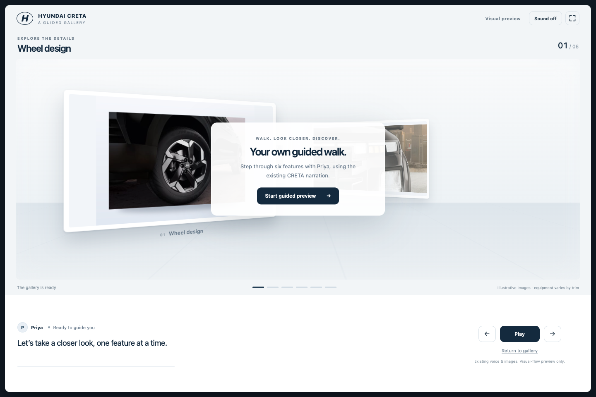
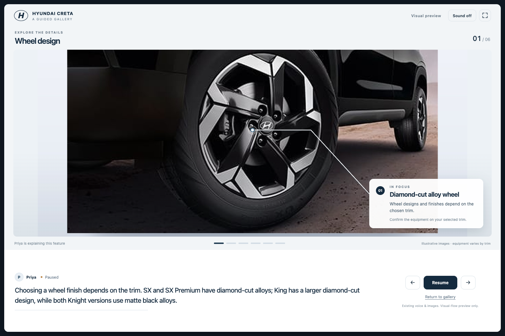
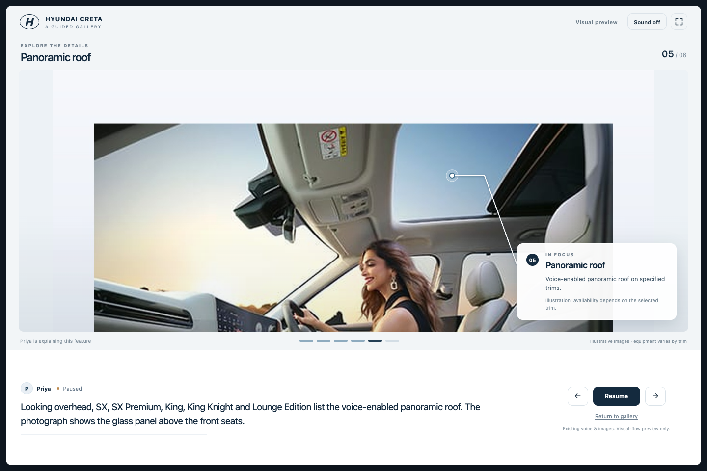
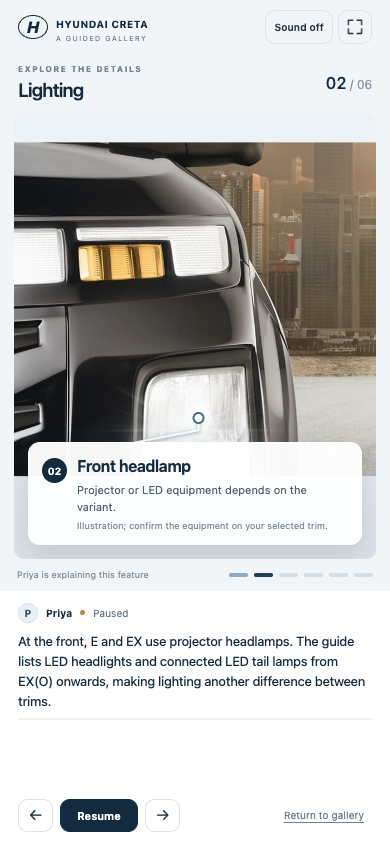
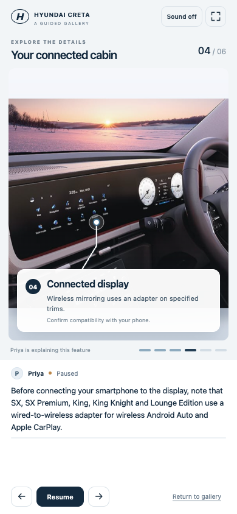

# Noise fix and standalone gallery — 25 September 2026

The localhost voice path accepted sound descriptions such as `[clears throat]`, `[coughing]?`, `Cough?` and `Ahem?`. The legacy fallback also cancelled its three-second resume timer when raw microphone energy crossed a threshold. Known noise now fails before it can own playback. An already-started legacy utterance can finish after automatic resume, within12seconds, and deliver once only while the same session/listen owner remains valid. Silence closes capture at the three-second boundary. Typing, explicit controls, mic/output mute, a new capture and Stop/Restart cancel stale delivery.

Implementation is limited to `web/player/live-voice.js`, the capture/ownership functions in `web/player/player.js`, and `evals/speech_noise_contract.mjs`. Independent review found an overly broad new server-STT policy rejected names/locations; it was narrowed to noise/fragment rejection only. The established live/browser question policy remains unchanged. No small Gemini agent, extra provider call, graph/node, core workflow or grounding rule is introduced. Speaker/echo acceptance remains physical work: meaningful TV speech, confident STT hallucinations and output echo can still qualify. Existing browser echo cancellation is requested, not proven effective by these tests.

The requested gallery is **a separate static artifact** at [localhost8911](http://127.0.0.1:8911/). Existing CRETA v3 photos and recordings supply six features: wheels, lights, rear seats, connected display, roof and charging. Each frame turns toward the customer, enlarges, focuses on a visible part, displays an on-image pointer/caption, plays its existing recording, then returns to the gallery. Native app slides and the source demo bundle retain their hashes. No source/voice regeneration, live Q&A, microphone request or publication occurs. The excerpt contains75.1seconds of existing narration; the full demo's193.78-second publication is unchanged. The complete excerpt, including transitions, played in118.7seconds at normal audio speed, muted.

Start and launch instructions: [artifact README](../../../output/gallery-preview-2026-09-25/README.md). Reference HTML source was inspected. Browser access to that original local file was denied and not bypassed; the new standalone artifact itself was browser-tested.

## Verification

- Core, mock/isolated/blocked sockets: **qa_deck399/399; qa_accept24/24; smoke3/3; zero outbound attempts**. Initial wrong `smoke.py` filename is retained; corrected runner uses `smoke_mock.py`.
- Focused **258/258**: speech_noise31, live_voice96, live_transport25, player_listen16, player_focus21, player_runtime_recovery17, player_http_question6, player_priority_revision11, player_session_save18, sarvam_stream17. Two additional independent checks used real automatic-resume/route and section-check-in functions, not just a mocked resume function.
- Browser **85/87**, identically on untouched master `cf33be2` and the new code. Existing failures: minimum phone evidence font size; expected directional cue for the third mobile evidence card. All other cases pass. Retained [baseline](player-browser-baseline.json) and [current](player-browser-current.json) reports. These are pending within the user's no-production-slide-edit boundary; no acceptance claim hides them or rewrites yesterday's receipt.
- Standalone gallery **69/69**: all six photos, exact narration/clip, unobscured pointers, bounded captions and paused audio at1440×960 and390×844; camera pause; rapid jump ownership; resize during narration/camera motion; reduced motion; completion/resize/replay; Return to gallery; no script errors or external requests. [Browser receipt](gallery-browser.json).
- Full natural-rate muted gallery replay: all six recordings,37 phase changes, completion, no script errors. [Natural replay](gallery-natural.json). The separate completion/replay control check seeks to the last audio frame; it is not presented as the natural replay.
- Source hashes, counts and unchanged production slide modules/bundle: [receipt](receipt.json). `node --check` and `git diff --check` pass. No paid call, AWS operation, port8896 operation or protected-demo mutation.

Desktop gallery and feature:





Phone evidence:




## Scoped FMEA and independent review

All twelve configured categories were reviewed against the voice ownership, no-new-agents, grounding, duration and presentation boundaries in PRD/architecture. Scores are severity×occurrence×detection on the configured1–10 scale; they prioritize this bounded change, not the full product. No new unresolved P0/P1 was found.

- **Unhandled errors — P2,3×2×2=12:** intentional audio AbortError initially stopped prototype narration; fixed with owner-scoped pause/resume/error handlers. Real recording failure still displays an explicit next-step status.
- **External dependency failure — P2,3×2×3=18:** late STT may never return. The retained capture expires within12seconds after automatic resume and releases resources; delayed results cannot act. No new model dependency.
- **Races/state — P2,4×2×2=16 after correction:** timer cancellation could discard a real long reply; added bounded ownership handoff. Independent real resume chains pass. Prototype resize previously committed old geometry; invalidate interrupted camera moves, refit paused narration, preserve completed/replay state.
- **Resource exhaustion — P2,3×2×2=12:** pending one-shot capture owns one bounded timer/stream; explicit cancellation stops tracks. Prototype owns one clip and cancels prior animations. Existing capture maximum remains unchanged.
- **Security/access — P2,2×1×2=4:** no new endpoint, external host, microphone permission or app data surface in the prototype. Local static review only; it is not deployed.
- **Data integrity — P2,3×1×2=6:** prototype copies existing media and preserves hashes; it cannot edit the source bundle. Stale finals cannot append a newer customer's question. Session persistence implementation is unchanged.
- **Observability — P2,4×3×4=48:** synthetic success cannot establish real microphone/TV/echo quality. This remains an explicit local hands-on acceptance item. Noise does not create a customer input timing record.
- **Scale/load — P2,2×1×2=4:** deterministic filtering and one already-existing capture; no extra backend concurrency. Full deployment capacity is outside this local change.
- **Billing/credits — P2,2×1×1=2:** no added Gemini classifier/call or paid QA. Original copied recordings play locally. Starting a new demo from the real-provider builder is a separate user action.
- **Retry/idempotency — P2,3×2×2=12:** duplicate final and stale owner cases, explicit Continue, typing, mic/output mute and new captures are covered. No automatic retry loop was added.
- **Configuration drift — P2,3×2×3=18:**8910 serves updated files after refresh; GitHub/master remain at the completed checkpoint and AWS remains separately older. Prototype8911 is not the app; launch commands identify storage and ports.
- **PRD edges — P2,3×3×3=27:** names/locations/household responses must survive deliberate capture, short controls remain local, genuine multilingual speech remains accepted. Production phone font/cue failures reproduce unchanged and are recorded pending; no slide edit is smuggled into the preview request.

Independent gallery review reproduced and then checked pending-play abort, skip/stale completion, resize geometry and mobile headlamp occlusion; its final completion/resize concern is covered by the69-case browser pass. Independent noise review caught and confirmed correction of the freeform-input regression and exercised real resume paths. Source review manually checked all six feature locations against the actual current photo bytes, including padding. Four-lens final sweep (misuse, stored-data boundaries, scaling/cost, maintainability) found no additional change-specific blocker; the physical-audio and existing-phone-assertion limits remain above.

## Local build and release state

Existing app: [http://127.0.0.1:8910/#/home](http://127.0.0.1:8910/#/home). Health returned200, mock false, local storage. It remains running for Anand. A separate builder can be started without replacing it:

```bash
cd /Users/macbook/Documents/demo-studio
MOCK_LLM=0 CLOUD_SYNC=0 STORAGE_BACKEND=local \
DEMO_STUDIO_DATA=/tmp/demo-studio-builder-20260925/data \
DEMO_STUDIO_GRAPH_DB=/tmp/demo-studio-builder-20260925/graph.sqlite \
.venv/bin/uvicorn server.app:app --host 127.0.0.1 --port 8912
```

Then open [localhost8912](http://127.0.0.1:8912/#/home). This command uses real configured providers when the user builds; this task did not launch that builder or make a paid call. Its `/tmp` storage is isolated temporary data, not a durable backup.

Yesterday's completed master/GitHub revision was freshly verified as `cf33be27363a622d0fb0a710a0ef8edb3a3ceb4b`. Today's changes stay on `codex/sales-trainer-flow`, locally checkpointed. No new merge, push or AWS deployment is included. Last recorded AWS release remains the older `483755d`; this was not freshly inspected on the host.
